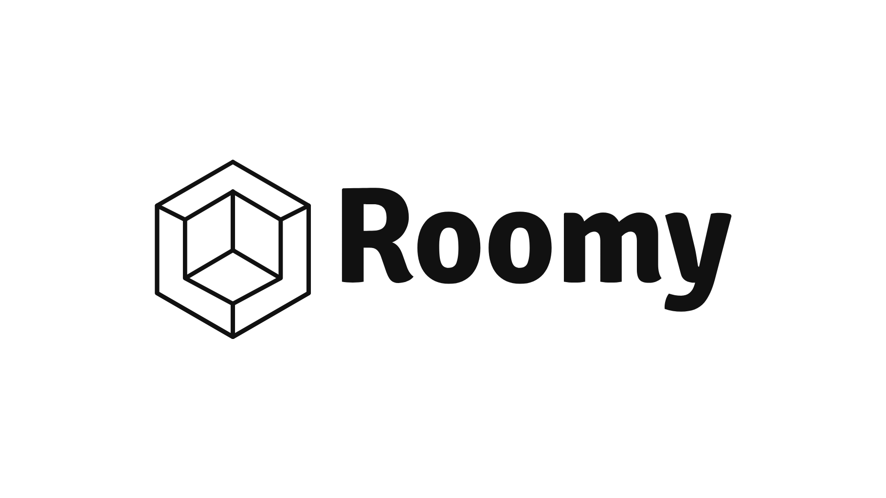

# Roomy

教室アナウンス API w/ Discord 🥂 for @iputapp

## Tech Stack

| Environments                 | Languages  | Linters                           | Frameworks   | Libraries       | Testing        | CI/CD                 | PaaS                                            |
| :--------------------------- | :--------- | :-------------------------------- | :----------- | :-------------- | :------------- | :-------------------- | :---------------------------------------------- |
| ![node-logo]<br>![pnpm-logo] | ![ts-logo] | ![biome-logo]<br>![lefthook-logo] | ![hono-logo] | ![valibot-logo] | ![vitest-logo] | ![githubactions-logo] | ![cloudflareworkers-logo]<br>![cloudflare-logo] |

[node-logo]: https://img.shields.io/badge/-Node.js-5FA04E.svg?logo=nodedotjs&style=flat&logoColor=ffffff
[pnpm-logo]: https://img.shields.io/badge/-pnpm-F69220.svg?logo=pnpm&style=flat&logoColor=ffffff
[biome-logo]: https://img.shields.io/badge/-Biome-60A5FA.svg?logo=biome&style=flat&logoColor=ffffff
[lefthook-logo]: https://img.shields.io/badge/-Lefthook-FF1E1E.svg?logo=lefthook&style=flat&logoColor=ffffff
[ts-logo]: https://img.shields.io/badge/-TypeScript-3178C6.svg?logo=typescript&style=flat&logoColor=ffffff
[sass-logo]: https://img.shields.io/badge/-Sass-CC6699.svg?logo=sass&style=flat&logoColor=ffffff
[hono-logo]: https://img.shields.io/badge/-Hono-E36002.svg?logo=hono&style=flat&logoColor=ffffff
[react-logo]: https://img.shields.io/badge/-React-61DAFB.svg?logo=react&style=flat&logoColor=525252
[tailwind-logo]: https://img.shields.io/badge/-Tailwind%20CSS-06B6D4.svg?logo=tailwindcss&style=flat&logoColor=ffffff
[valibot-logo]: https://img.shields.io/badge/🤖-Valibot-54AEFF.svg?logo=&style=flat&logoColor=ffffff&labelColor=54AEFF
[vitest-logo]: https://img.shields.io/badge/-Vitest-6E9F18.svg?logo=vitest&style=flat&logoColor=ffffff
[githubactions-logo]: https://img.shields.io/badge/-GitHub%20Actions-2088FF.svg?logo=githubactions&style=flat&logoColor=ffffff
[cloudflareworkers-logo]: https://img.shields.io/badge/-Cloudflare%20Workers-F38020.svg?logo=cloudflareworkers&style=flat&logoColor=ffffff
[cloudflare-logo]: https://img.shields.io/badge/-Cloudflare-F38020.svg?logo=cloudflare&style=flat&logoColor=ffffff

### Other

- [discord-interactions-js](https://github.com/discord/discord-interactions-js)
- [discord-api-types](https://github.com/discordjs/discord-api-types)
- [googleapis](https://github.com/googleapis/google-api-nodejs-client)
- [tsx](https://github.com/privatenumber/tsx)

## Development

1. [必須](#必須)
2. [環境変数](#環境変数)
3. [コマンド](#コマンド)

### 必須

```ini
node = ">=22"
pnpm = ">=10"
```

> [!TIP]
>
> 詳細は[`.prototools`](./.prototools)および[`package.json`](./package.json)の`engines|packageManager`を参照する。

### 環境変数

```ini
NODE_ENV=development
API_ENDPOINT_URL=https://your_api_endpoint_url
API_ENDPOINT_SECRET=your_generated_secret
DISCORD_TOKEN=your_discord_token
DISCORD_APPLICATION_ID=your_discord_application_id
DISCORD_PUBLIC_KEY=your_discord_public_key
DISCORD_CHANNEL_ID=your_channel_id
GOOGLE_CLIENT_EMAIL=your_google_client_email
GOOGLE_PRIVATE_KEY=your_google_private_key
SPREADSHEET_ID=your_spreadsheet_id
```

> [!TIP]
>
> 詳細は[`.env.example`](./.env.example)を参照する。

### コマンド

#### パッケージのインストール

```sh
pnpm i
```

> [!IMPORTANT]
>
> 初回インストールの後（保存時のフォーマットが動作しない場合）は、VS Code (IDE)を再起動する。

#### 開発サーバの起動

```sh
pnpm dev
```

#### 開発サーバをパブリックに公開

```sh
pnpm dev
pnpm start
```

[ngrok](https://ngrok.com)を使用して`localhost:8787`をパブリックに公開する。

> [!IMPORTANT]
>
> [ngrok - Setup & Installation](https://dashboard.ngrok.com/get-started/setup)から環境に合わせて`ngrok`を導入する。
>
> Windows は`Download for Windows (64-Bit)`でダウンロードおよび解凍した exe ファイルを、レポジトリのルートディレクトリに置く。

> [!TIP]
>
> テスト用 Discord App `INTERACTIONS ENDPOINT URL`の設定に利用する。
>
> ドキュメント: [Discord Developers - Set up a public endpoint](https://discord.com/developers/docs/quick-start/getting-started#step-3-handling-interactivity)

#### リンターのチェック

```sh
pnpm lint
```

#### コードのフォーマット

```sh
pnpm format
```

#### デプロイ

```sh
pnpm deploy:mini
```

#### コマンドを Discord に登録

```sh
pnpm register
```

> [!TIP]
>
> スラッシュコマンドの一覧は[`src/constants/config.ts`](./src/constants/config.ts)の`DISCORD_COMMANDS`を参照する。

#### API エンドポイント認証のキーを生成

```sh
pnpm gen:secret
```

> [!IMPORTANT]
>
> 生成したキーは環境変数 [`API_ENDPOINT_SECRET`](#環境変数) に設定する。

## Documents

- [API エンドポイント](#apiエンドポイント)
- [実行スケジュールを変更する](#実行スケジュールを変更する)

### API エンドポイント

- [API v1](#api-v1)

#### API v1

- [Discord v1](#discord-v1)
- [Google v1](#google-v1)
- [Cron v1](#cron-v1)

##### Discord v1

```
POST /v1/discord/interaction
```

Discord App [`INTERACTIONS ENDPOINT URL`の設定](https://discord.com/developers/docs/quick-start/getting-started#adding-an-interaction-endpoint-url)に利用する。

##### Google v1

```
GET /v1/google/sheets/room/today
```

Google Sheets から**今日の教室情報**を取得する。

##### Cron v1

```
POST /v1/cron
```

定期アナウンスの Cron に設定する。

#### 認証について

センシティブな API エンドポイントは認証を設けている。

認証付きのパスは以下:

- [Google v1](#google-v1)
- [Cron v1](#cron-v1)

##### クライアントでのリクエスト例

```ts
async function makeAuthenticatedRequest(path: string) {
  const timestamp = Date.now().toString();
  const apiKey = "your_secure_random_string"; // API_ENDPOINT_SECRETと同じ値

  // 署名の生成
  const payload = timestamp + path;
  const signature = await generateHMAC(payload, apiKey);

  const response = await fetch(`https://your-api.com${path}`, {
    headers: {
      "X-Request-Timestamp": timestamp,
      "X-Signature": signature,
    },
  });

  return response;
}
```

> [!NOTE]
>
> `generateHMAC()`の内容は[`src/utils/crypto.ts`](./src/utils/crypto.ts)を参照する。

### 実行スケジュールを変更する

[`wrangler.toml`](./wrangler.toml)の`crons`を変更する。

> [!TIP]
>
> cron のタイムゾーンは`UTC`のため、`日本時間(JST)-9時間`を設定する。
